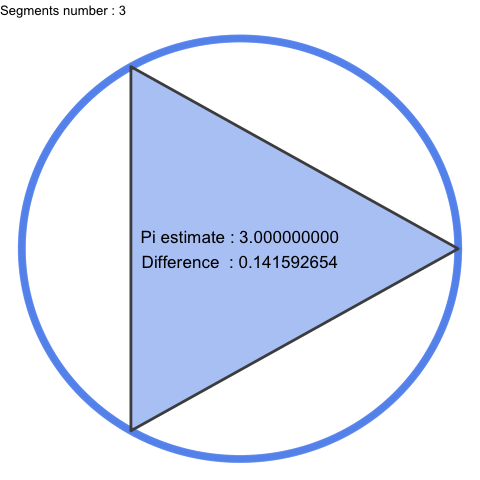

# under_pi

## A gganimate test around quadrature of the circle

*An updated look on squaring the circle using gganimate and R code.*

*It gives a geometric and visual construction, a good and practical representation of what Pi is.*
*As n becomes larger, segments become smaller and smaller, Pi can then be seen as perfection and we almost intuit infinity.*

